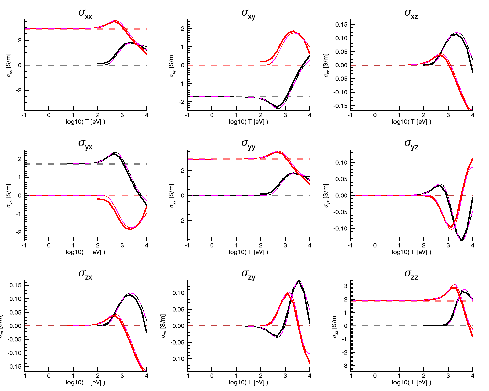

This benchmark is a scan of Te for a D plasma, with ky = 0. 

Build with the following flags ...
```
CPPFLAGS += -D_PARTICLE_BOUNDARY=2
CPPFLAGS += -DCYLINDRICAL_INPUT_FIELDS=0
```
These are for periodic boundaries for the particles, and input E1 fields in Cartesian.

Run on gpufusion with ...
```
qsub -I
source ~/code/kineticj/env-gpufusion.sh
cd ~/scratch/kineticj
cp -r ~/code/kineticj/benchmarks .
cd benchmarks/benchmark1
idl
IDL>kj_sigma_benchmarks, benchmark = 1, runKJ=1
```
The resulting output in `benchmarks/benchmark1/kj_sigma_vs_t.png` should look like ...

